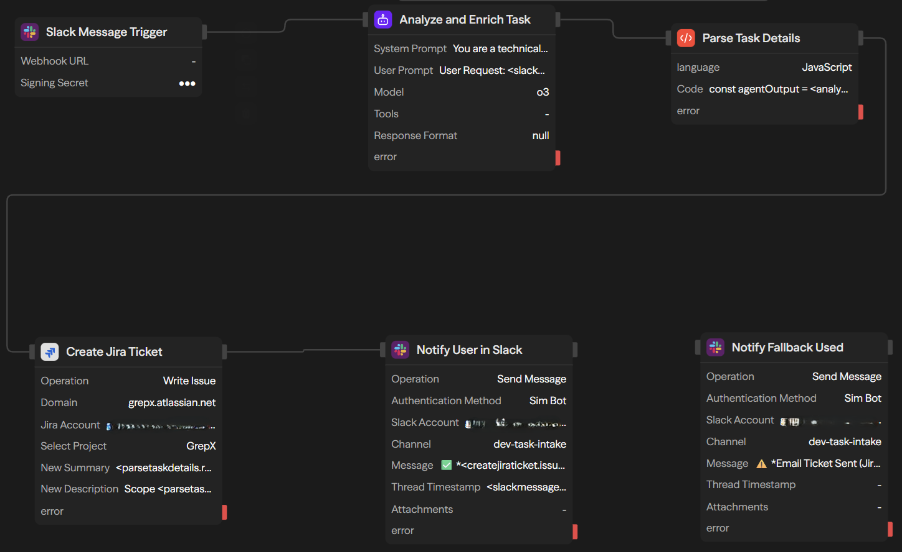

# slack-jira-agent

> AI-powered workflow automation that transforms Slack messages into contextually enriched Jira tickets with zero manual intervention.

[]()
[]()



## Overview

An intelligent task intake system that uses LLM-driven analysis to automatically convert natural language requests from Slack into fully-contextualized Jira tickets. Built on Sim.ai's visual workflow platform with Claude Sonnet 4 integration.


### Key Features

- **Zero-Touch Automation**: Mention bot in Slack → Jira ticket created in <15s
- **AI-Powered Enrichment**: LLM analyzes requests to infer complexity, priority, modules, and effort
- **Smart Context Extraction**: Strips bot mentions, formats timestamps, structures metadata
- **Thread-Aware Notifications**: Replies in Slack threads with ticket links and metrics
- **Enterprise-Ready**: Error handling, retry logic, fallback mechanisms

### Tech Stack

| Layer | Technology | Purpose |
|-------|-----------|---------|
| Workflow Engine | Sim.ai | Visual workflow orchestration |
| LLM | Claude Sonnet 4 (o3) | Task analysis & enrichment |
| Event Source | Slack Events API | Webhook-based triggers |
| Ticketing | Jira Cloud REST API | Issue creation & management |
| Runtime | Node.js (Sim.ai) | JavaScript function execution |

---

## Architecture

```
┌─────────────┐
│   Slack     │  User: @bot Create task for X
│  #channel   │
└──────┬──────┘
       │ Webhook (app_mention event)
       ▼
┌─────────────────────────────────────────┐
│          Sim.ai Workflow Engine         │
├─────────────────────────────────────────┤
│  ┌──────────────────────────────────┐   │
│  │  1. Slack Message Trigger        │   │
│  │     - Validates event payload    │   │
│  │     - Extracts user/text/ts      │   │
│  └───────────┬──────────────────────┘   │
│              ▼                           │
│  ┌──────────────────────────────────┐   │
│  │  2. LLM Analysis (Claude Sonnet) │   │
│  │     - Parses natural language    │   │
│  │     - Infers complexity (1-5)    │   │
│  │     - Extracts modules & labels  │   │
│  │     - Estimates effort (hours)   │   │
│  └───────────┬──────────────────────┘   │
│              ▼                           │
│  ┌──────────────────────────────────┐   │
│  │  3. Parse & Format (JavaScript)  │   │
│  │     - Strips bot mentions        │   │
│  │     - Formats Unix → readable    │   │
│  │     - Arrays → comma-separated   │   │
│  └───────────┬──────────────────────┘   │
│              ▼                           │
│  ┌──────────────────────────────────┐   │
│  │  4. Create Jira Ticket           │   │
│  │     - Structured description     │   │
│  │     - Auto-priority mapping      │   │
│  │     - Custom field population    │   │
│  └───────────┬──────────────────────┘   │
│              ▼                           │
│  ┌──────────────────────────────────┐   │
│  │  5. Slack Notification           │   │
│  │     - Thread reply with link     │   │
│  │     - Metrics (priority/effort)  │   │
│  └──────────────────────────────────┘   │
└─────────────────────────────────────────┘
       │
       ▼
┌──────────────┐
│  Jira Cloud  │  Ticket: PROJ-123
│   REST API   │  Status: Created
└──────────────┘
```

---

## Workflow Configuration

### 1. Slack Event Subscription

**Event:** `app_mention`  
**Scopes Required:**
- `app_mentions:read` - Receive @mentions
- `chat:write` - Send notifications
- `channels:history` - Read channel context

**Webhook URL:** `https://www.sim.ai/api/webhooks/trigger/{workflow_id}`

### 2. LLM Analysis Prompt

**System Prompt:**
```
You are a technical task analyzer. Extract structured task details.

Output format (plain text, one per line):
TITLE: [concise title, max 80 chars]
DESCRIPTION: [detailed analysis with context]
MODULES: [comma-separated: frontend, backend, database, etc]
ASSIGNEE: support@company.com
COMPLEXITY: [1-5 scale]
PRIORITY: [Low|Medium|High|Critical]
HOURS: [estimated hours as integer]
LABELS: [comma-separated tags]

Defaults if uncertain:
- COMPLEXITY: 3
- PRIORITY: Medium
- HOURS: 4
```

**Model:** Claude Sonnet 4 (via Sim.ai)  
**Temperature:** 0.3 (deterministic output)

### 3. Parse & Format Function

```javascript
// Sanitize input
const cleanText = slackInput.replace(/<@[A-Z0-9]+>/g, '').trim();

// Parse LLM structured output
const titleMatch = agentOutput.match(/TITLE:\s*(.+)/i);
const complexityMatch = agentOutput.match(/COMPLEXITY:\s*(\d+)/i);

// Format timestamp: Unix → "Nov 14, 2024, 1:30 PM"
const date = new Date(parseFloat(slackTimestamp) * 1000);
const formattedTime = date.toLocaleString('en-SG', {
  timeZone: 'Asia/Singapore',
  year: 'numeric',
  month: 'short',
  day: 'numeric',
  hour: '2-digit',
  minute: '2-digit'
});

// Format arrays: ["module1", "module2"] → "module1, module2"
taskDetails.modules_formatted = taskDetails.affected_modules.join(', ');
```

### 4. Jira Ticket Template

```
Scope
{AI-generated detailed description}

Details
Modules: {comma-separated list}
Effort: {hours}h (Complexity {1-5}/5)
Labels: {comma-separated tags}

Context
Requested by {slack_user_id} on {formatted_timestamp}
Original: _{user's exact message}_
```

### 5. Slack Notification Template

```
✅ PROJ-123 created

https://company.atlassian.net/browse/PROJ-123

Implement user authentication flow
Priority: High | Complexity: 4/5 | Est: 8h
```

---

## Implementation Guide

### Prerequisites

1. **Sim.ai Account** (Free tier sufficient)
2. **Slack Workspace Admin Access**
3. **Jira Cloud Instance** with API access

### Setup Steps

#### 1. Create Slack App

```bash
# Navigate to https://api.slack.com/apps
# Create new app → From scratch
# App Name: "Jira Agent"
# Workspace: Select your workspace
```

**OAuth Scopes:**
- `app_mentions:read`
- `chat:write`

**Event Subscriptions:**
- Enable Events: ON
- Request URL: `{sim.ai_webhook_url}`
- Subscribe to bot events: `app_mention`

#### 2. Import Workflow to Sim.ai

1. Download [`workflow_config.json`](./config/workflow_config.json)
2. Sim.ai Dashboard → Import Workflow
3. Update credentials:
   - Slack OAuth token
   - Jira API token

#### 3. Configure Environment Variables

```bash
# Create .env file (for local testing)
SLACK_SIGNING_SECRET=your_signing_secret
JIRA_DOMAIN=yourcompany.atlassian.net
JIRA_EMAIL=bot@yourcompany.com
JIRA_API_TOKEN=your_jira_token
ANTHROPIC_API_KEY=sk-ant-xxx
```

#### 4. Test Workflow

```bash
# In Slack channel where bot is installed:
@jira-agent Create task for implementing user authentication

# Expected output (within 15s):
✅ PROJ-456 created
https://yourcompany.atlassian.net/browse/PROJ-456
Implement user authentication
Priority: High | Complexity: 4/5 | Est: 8h
```

---

## File Structure

```
slack-jira-agent/
├── README.md                      # This file
├── architecture.png               # System diagram
│
├── config/
│   ├── workflow_config.json       # Anonymized Sim.ai workflow export
│   ├── slack_manifest.yaml        # Slack app configuration
│   └── jira_fields_mapping.json   # Custom field mappings
│
├── docs/
│   ├── SETUP.md                   # Detailed setup instructions
│   ├── CUSTOMIZATION.md           # Adapting to your use case
│   ├── TROUBLESHOOTING.md         # Common issues & solutions
│   └── API_REFERENCE.md           # Sim.ai block specifications
│
├── examples/
│   ├── slack_messages.md          # Example inputs
│   ├── jira_tickets.md            # Expected outputs
│   └── edge_cases.md              # Handling ambiguous requests
│
├── scripts/
│   ├── anonymize_workflow.js      # Strip PII from exports
│   ├── test_slack_webhook.sh      # Local webhook testing
│   └── validate_config.js         # Pre-deployment checks
│
└── tests/
    ├── unit/
    │   ├── parse_function.test.js # JavaScript function tests
    │   └── prompt_validation.test.js
    └── integration/
        └── end_to_end.test.js     # Full workflow simulation
```

---

## Customization

### Adapting for Your Organization

**1. Modify LLM System Prompt**

Add domain-specific context:
```
Your organization uses microservices architecture:
- auth-service (Node.js)
- payment-gateway (Python)
- frontend-app (React)

When analyzing tasks, infer which service is affected.
```

**2. Custom Jira Fields**

Map additional fields in Jira block:
```yaml
custom_fields:
  epic_link: "EPIC-123"
  story_points: "{{complexity * 2}}"
  team: "Platform Engineering"
```

**3. Alternative LLM Providers**

Replace Claude with OpenAI GPT-4:
```yaml
agent_block:
  model: gpt-4-turbo
  provider: openai
  api_key: ${OPENAI_API_KEY}
```

---

## Error Handling

### Retry Logic

**Jira API Failures:**
- Max retries: 3
- Backoff: Exponential (1s, 2s, 4s)
- Fallback: Send error to Slack with manual ticket link

**LLM Timeouts:**
- Timeout: 30s
- Fallback: Use defaults (Medium priority, 4h estimate)

### Edge Cases

| Scenario | Behavior |
|----------|----------|
| Bot mentions itself | Filtered by condition block |
| Malformed LLM response | Parse function extracts defaults |
| Jira connection down | Error notification + email to ops |
| Empty Slack message | Rejected at trigger (min 10 chars) |

---
## Security Considerations

### Secrets Management

- All credentials stored in Sim.ai's encrypted vault
- Webhook signature validation 
- Least-privilege API tokens (read/write only needed scopes)

### Data Privacy

- No message content stored in Sim.ai logs
- Jira tickets inherit project-level permissions
- PII scrubbing in Parse function (optional)

### Rate Limiting

- Slack: 1 req/sec per workspace
- Jira: 100 req/min (standard tier)

---

## Roadmap

- [ ] **Multi-channel support**: Trigger from MS Teams, Discord
- [ ] **Knowledge base integration**: RAG with codebase docs
- [ ] **Duplicate detection**: Check existing Jira tickets
- [ ] **Approval workflow**: Manager review before ticket creation
- [ ] **Analytics dashboard**: Track request patterns & LLM accuracy
- [ ] **Voice input**: Slack audio messages → transcribe → analyze

---

## Areas needing improvement
- [ ] Unit test coverage 
- [ ] Support for Jira Data Center (self-hosted)
- [ ] Better error messages in Slack notifications

---

## License

MIT License

---

## Acknowledgments

- **Sim.ai** for visual workflow platform
- **Slack Events API** for reliable webhooks
- **Jira Cloud REST API** for comprehensive issue management

---

## Author

**Sushil Duseja**  
[LinkedIn](https://linkedin.com/in/sushilduseja)

*Built as a demonstration of AI workflow automation, event-driven architecture, and enterprise integration patterns.*

---

## Technical Highlights

✅ **Microservices Integration**: Orchestrates SaaS APIs (Slack, Jira)  
✅ **LLM Prompt Engineering**: Structured output extraction with fallback logic  
✅ **Event-Driven Architecture**: Webhook-based triggers, async processing  
✅ **Error Resilience**: Retry mechanisms, circuit breakers, graceful degradation  
✅ **Production-Ready**: Schema validation, rate limiting, secret management  
✅ **Zero Infrastructure**: Serverless execution on Sim.ai platform  

---